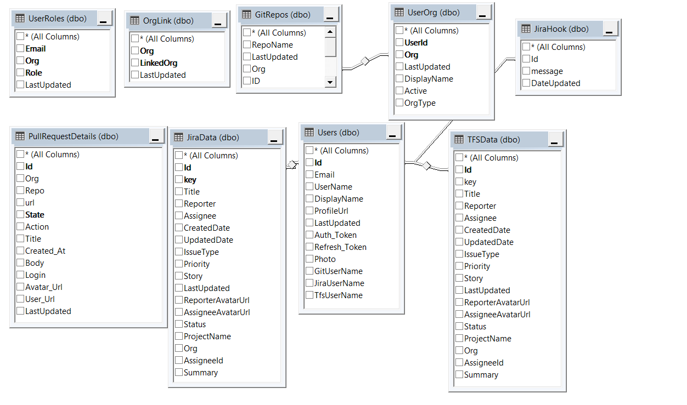
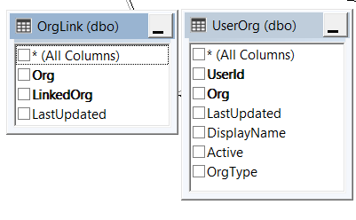
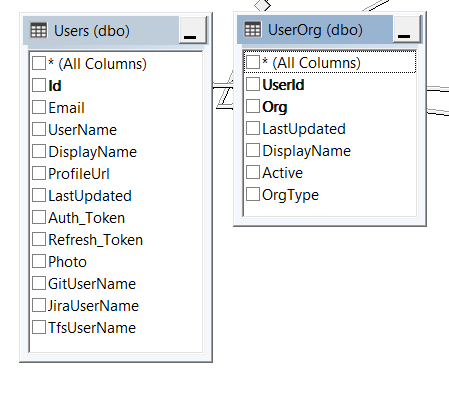
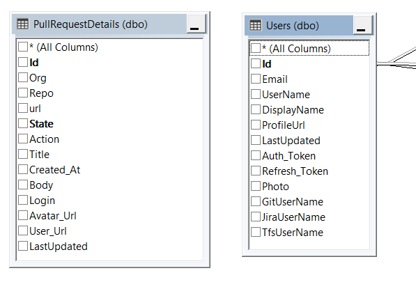
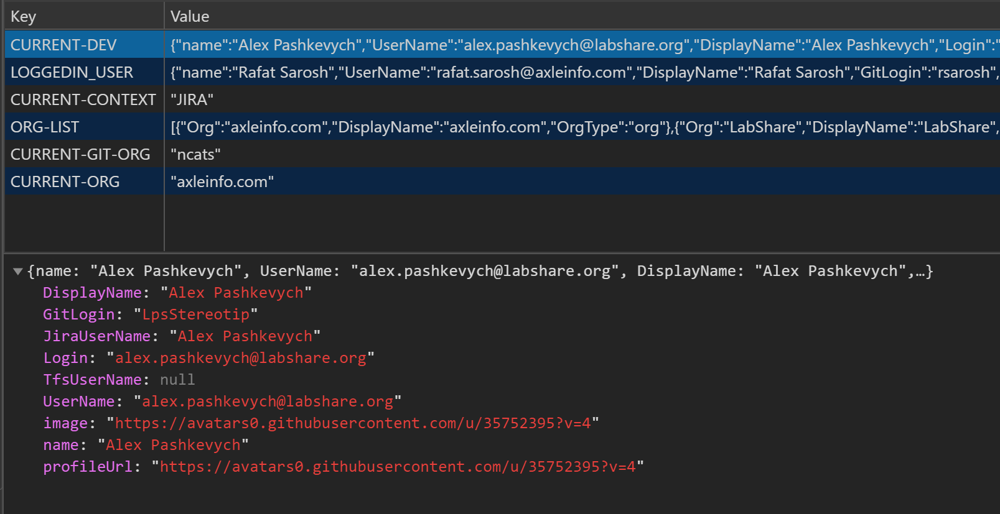

# Internal Design



# Users

This table keeps all the information about the user. Id is from LSAuth and it is unique across all the tenants. This table is updated when user signs in. GitUserName, JiraUserName, and TfsUserName is updated later by individual user using the admin in GG Screen. After this table another call(SaveUserOrg) is made from the Passport file in BE to update **UserOrg**. This table Org is actually **Tenant** for the OrgType = 'org'. This table also keeps Git Org for the user name. Git Org OrgType = 'Git'.  

>OAuth token is also kept here. User Id is send to client as Auth Token. When the client calls back BE (Backend) it put this token in the header. BE gets the Id from the Header calls the BE to get the token and then make the calls to any of the services in BE. 

# PullRequestDetails 

This table is updated by GitWebhook. This table is also filled by at the time of hydration for the first use.


# UI Data Flow

There are two kind of organization is GG. One is Tenant Org e.g. AxleInfo and then there are Git Organization e.g Labshare, NCATS etc. Tenant (org) and Git Org are connected thru OrgLink Table. Hydration process updates this table.



**GetOrg** calls SP **getOrg4UserId**, which Connects OrgLink and Org Table for the user and get all the Git Org and Tenant Org. It returns data as such
```
[
    {"Org":"axleinfo.com","DisplayName":"axleinfo.com","OrgType":"org"},
    {"Org":"LabShare","DisplayName":"LabShare","OrgType":**"git"**},
    {"Org":"ncats","DisplayName":"National Center for Advancing Translational Sciences","OrgType":**"git"** }
]
```
> Most of the call from UI has TenantOrg or GitOrg in API calls

> How the two tenants are merged e.g. Labshare and AxleInfo?
This merge happen at the user logged in time. Labshare user Org(Tenant) is saved as AxleInfo. There is LabShare tenant and then there is a Git org called 'Labshare'. However, in DB Labshare Tenant is rolled into AxleInfo. 

>When we have to Roll a NIH user to one of the Tenant, we have to update this user org in UserOrg table. For example, Mariam can login system using her NIH credential and her information will be saved in USers table, then we have to manually update the UserOrg table for her.  Later on this can be done thru a screen in Admin


**GetUser4Org**?org=axleinfo.com for the Org(Tenant). Get all the Users for the Org from UserOrg and then join with Users and get all Users attributes.





First screen of Git activity calls TopDevForLastXDays BE API. which calls SP **TopDevForLastXDays** SP. This SP depend upon TopDevVW. Which actually depend up on **vwOpenClosePR** and User. vwOpenClosePR pulls data from **PullRequestDetails** table and Users. PullRequestDetails and Users connected on Users.GituserName and Login. Data is filtered on GitOrg, and the org is picked up from PullRequestDetails.



and when user clicks on the Dev name in Git context, **PullRequest4Dev** API is called, which in turn calls **getPR4Dev** which calls SP **PR4Devs**, which in turn pulls data from  **vwOpenClosePR**

When user clicks on dev name in "Jira Context", **GetJiraData** is called which in turn pulls the data from **JiraData**

## GetTopRespositories4XDays

**GetTopRepos4XDays** SP is called. Which is depended on  **vwOpenClosePR**

# USer Session Store
USer session store stores the followings:



GG extensively uses this infomation about the logged in user and the Current-dev which changes as logged in user clicks aroud on different users. 

current-org is Tenant Org. 

As use clicks on Git/Jira and TFS, current-context changes accordingly.
